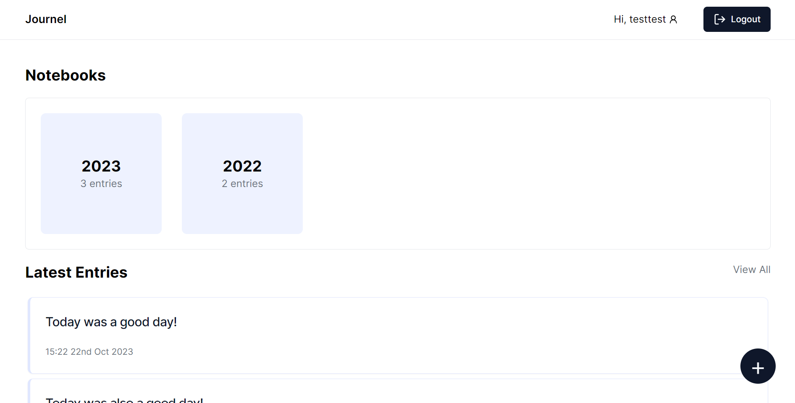
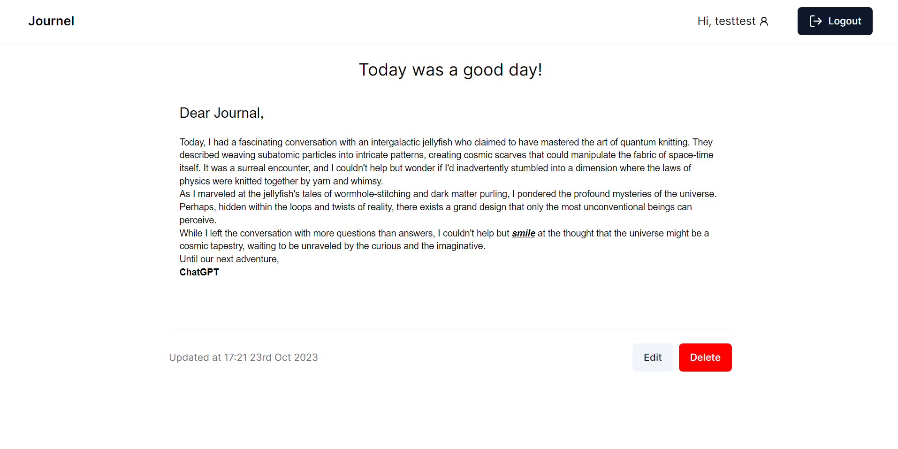

# Journel

## Table of Contents

- [About](#about)
- [Getting Started](#getting_started)
- [Acknowledgements](#acknowledgements)

## About<a name = "about"></a>

A journal app made in Next.js 13 and Express.js. The backend uses MongoDB (with mongoose) and express-session. The frontend uses react with tailwindcss, shadcn and react-quill.

Home page:


Journal page:


## Getting Started<a name = "getting_started"></a>

These instructions will get you a copy of the project up and running on your local machine for development and testing purposes.

### Prerequisites

Install the required packages by running `npm install` in the client and server directories.


### Installing

Create a `.env.local` file in the `client/` directory with:
```
NEXT_PUBLIC_BASE_URL=http://127.0.0.1:5000
```

Create a `.env` file in the `server/` directory with:
```
MONGO_CONNECTION_STRING=[mongodb connection string]
PORT=5000
SESSION_SECRET=[random secret]
```

To run the app in development mode, you will need to run the following command:
- `npm start` in `server/`
- `npm run dev` in `client/`


## Acknowledgements<a name = "acknowledgements"></a>

[Design Inspiration](https://dribbble.com/shots/14969350-Journalling-App-Concept)

Special thanks to to [Coding in Flow](https://www.youtube.com/@codinginflow/) for their helpful tutorials, which were instrumental in the development of this project.